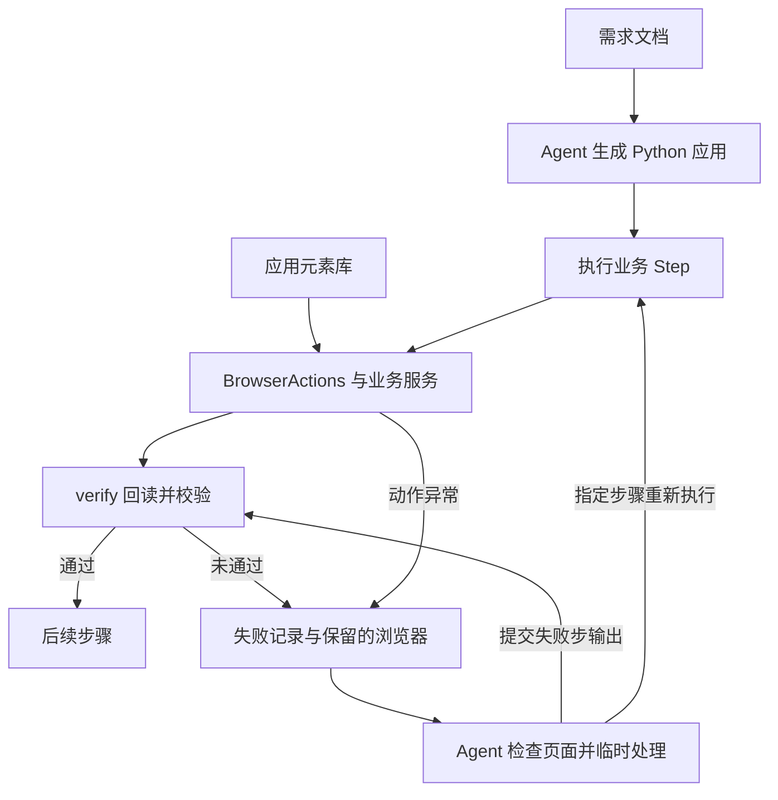

# RPA 核心框架设计 V3

本文说明已确认的架构与现有运行契约。后续改进的任务、顺序和验收标准见 [Agent 开发与接管实施文档](rpa-agent-implementation.md)。

## 1. 两个应用确认的边界

2026-09-05 设计复查确认：
- 只有聚水潭库存导出和京麦商品明细导出两个测试应用，没有旧应用兼容要求。
- 下载验收是拿对报表并成功下载，不解析 Excel 核对业务数据。
- 导出失败允许从头重跑，也支持 agent 判断恢复位置后续跑；接受必要时重复生成同条件的平台报表。
- 下载路径可指定，默认 Windows 系统下载文件夹；所有命令保留已有文件，同名下载改名，不做目录并发协调。
- 后续支持飞书、数据库和平台操作。写入按业务提供的事务方式执行，不在框架内设计部分写入恢复、补偿或重复处理。
- 上线后无人值守，不逐次人工确认。

这些约定采用 agent 指定恢复点的续跑方式，替代旧的自动检查点恢复与逐次授权设计。

## 2. 核心结构

BrowserActions 隔离浏览器实现，Element 集中定位器，Step 描述有序业务进展。
CLI 统一配置加载、浏览器生命周期、下载目录准备、执行与测试。

程序依次调用每步 execute 和 verify。校验通过才记录成功；失败记录步骤、错误类型并结束。
run 从第一步开始。resume 读取原失败记录，沿用原业务参数和恢复点之前的成功结果；两者均创建新日志目录。
登录与身份检查也是普通 Step，不使用应用自定义 prepare / cleanup / verify_recovery 钩子。

### 2.1 面向 Agent 的架构取舍

Agent 根据需求生成普通 Python 应用，正式任务沿既定步骤执行；遇到程序无法处理的页面状态时，由 Agent 检查原因、临时处理，再交回框架校验和续跑。框架优先保证步骤的输入、输出、成功条件和恢复位置清楚。

| 结构 | 决策 | 职责与范围 |
| --- | --- | --- |
| 应用元素库 | 保留轻量的应用内定义 | 维护正式流程使用的页面目标、当前定位方式与阶段检查；不预先登记整站元素，不建立全局资产平台 |
| BrowserActions | 保留少量普通操作 API | 封装已有实际需求的等待、回读、新标签页、下载和错误处理；不逐个复制底层库的全部方法 |
| 业务操作函数 | 先放在应用内 | 使用普通函数组织日期选择、品牌筛选等操作；第三个真实应用证明重复后再抽取共享业务能力 |
| 指令注册与编排体系 | 不建设 | 条件、循环、变量与数据处理直接使用 Python；不增加指令 ID、流程解释器或另一套自定义语言 |
| Step | 作为业务执行与接管的单位 | 描述一次可检查的业务进展；正常 execute 与 Agent 提交的结果使用同一 verify |

### 2.2 元素库与操作 API 的维护规则

元素 ID 对应业务目标，定位器对应当前页面实现。更换定位器时，目标账号、日期、品牌、报表和其他成功条件保持原定义。匹配到一个元素只证明定位结果，业务结果仍由 Step 回读检查。

正式流程使用的目标保存在应用 elements.toml。一次接管中发现的引导提示、临时弹窗等辅助目标，可以根据实际 DOM 构造临时 ElementSpec，通过 ctx.browser 操作，并在运行目录留证；不要求先登记为永久元素。截图用于理解页面，定位表达式仍需实际 DOM 确认。临时辅助目标与 --locator-overrides 不同：后者只覆盖已有元素 ID 的定位字段，不能添加元素 ID 或改变验收条件。

只有当某个辅助操作成为应用正常流程的必要部分，才将其整理进应用代码和元素库，并补充对应测试。重复遇到同类失败时，依据运行证据决定是否永久修复；一次成功接管不自动改写应用文件。

新增 BrowserActions 方法应说明已有操作无法解决的具体问题、共享的稳定性处理和可检查的结果。应用专有操作留在业务函数中；标准 Python 已能表达的逻辑直接使用 Python。

2026-09-05 的聚水潭接管中，关闭页面引导提示后完成品牌选择，框架接受 S003 实际输出并继续 S004、S005。这说明接管还需要处理页面状态；维护定位器本身不能替代观察和结果校验。验收事实见 [聚水潭需求基线](../apps/inventory_jushuitan_export_stock/requirement.md)。

## 3. 文件与配置

每个应用保留：
- app.toml：app_id、name、entrypoint。
- requirement.md：来源版本、业务流程、输入输出、未决问题、验收事实。
- elements.toml：定位器、expect_count、check_at。
- 独立依赖、锁文件、环境、应用代码与测试。
- config/stores.example.toml 和忽略的 stores.local.toml。

download_directory 相对于应用目录解析，也可指定绝对路径。
两个样本省略该配置时，通过 Windows 的 [SHGetKnownFolderPath](https://learn.microsoft.com/en-us/windows/win32/api/shlobj_core/nf-shlobj_core-shgetknownfolderpath) 读取当前用户实际下载文件夹；非 Windows 开发环境使用 ~/Downloads。
浏览器下载和文件校验均使用此目录；新 run、verify-elements 和 resume 都保留已有文件。重名时下载为新文件，返回实际路径，不复用旧文件冒充本次结果。
目标与应用目录、证据目录及其祖先或子目录重叠时，在启动浏览器前拒绝；不执行递归清理。

load_runtime_options(RunRequest) 接收 account_id、inputs、credentials、download_dir，返回验证后的 RuntimeOptions。CLI 的 --inputs 和 --credentials 接受 JSON 对象或 @JSON文件，--download-dir 单独覆盖下载目录；doctor 与 verify-elements 接受同样参数。显式调用参数覆盖本地默认，参数齐全时无需本地配置文件。
业务参数的键和约束由应用在 requirement.md 声明，不在核心硬编码周/月/日等范围。当前京麦支持 target_date、export_filename；聚水潭支持 brand_value、export_filename。未知键、非法日期、非法文件名在启动浏览器前拒绝。当前样本的 export_filename 使用 ASCII 文件名，目录可含中文。账号权限在业务系统实际配置，程序回读目标身份，本地布尔声明不作为权限证明。

日志、截图与 result.json 保存在各应用 runs/<run_id>。result.json 保存账号、模式、下载目录、业务输入、完成步骤、输出和失败诊断，每步更新；resume 用这些记录恢复业务上下文，原记录不覆盖。
下载检查目标匹配、传输完成、文件在指定目录且非空。
底层下载引用的校验码只作附加信息，不证明业务数据正确，不重复计算。

## 4. 测试先有正常场景

V2 把任意 execute 异常算作反例通过，导致两个下载步骤的 verify 改成恒真仍能通过。
京麦的正常测试与反例工厂中的弹窗文本表示也曾不一致。

每个应用只维护一个 build_test_context(step, case, temporary_root)：
- case 为 None：execute 必须成功且 verify 返回 True。
- 普通反例：execute 完成后，verify 必须返回 False。
- 动作失败：明确 expected_error，其他异常算测试故障。
- after_execute 可修改假页面或假文件，构造动作完成后结果错误的场景。
- 每步至少有一个结果反例，不能全部依靠动作异常过关。

这些测试证明所列条件被检查，不声称覆盖所有业务错误。
实际定位器仍需在授权真实页面用阶段化 verify-elements 验证。

## 5. 正式运行与业务服务

run 默认 live 模式，没有交互询问、授权记录、TTL、一次性凭证。
--preview 通过 context.mode 交给支持预览的业务服务；它不是离线测试，也不阻断所有网页操作。
开发验收时确认账号、目标、范围。agent 另行开展真实验证仍需用户授权。

ApplicationDefinition.build_services(context) 向同一运行注入具体服务，
业务通过 ctx.feishu / ctx.db / ctx.excel 调用。未配置服务直接报错，没有默认假后端。
工厂只构造服务，业务操作放在 Step；事务、连接资源和可选预览由服务负责。
框架不重试写入，不补偿部分写入。

当前两个应用仅使用浏览器。真实飞书、数据库适配跟第一个实际写入需求完成，
不提前猜目标表、字段映射或事务策略。

## 6. 命令

在各应用目录执行：

    uv run rpa-app doctor
    uv run rpa-app test
    uv run rpa-app verify-elements --account STORE_001
    uv run rpa-app run --account STORE_001
    uv run rpa-app run --preview --account STORE_001
    uv run rpa-app resume <run_id> --from-step S006

doctor、test 离线，不启动浏览器或修改真实下载目录。
verify-elements、run 都会真实运行并保留配置下载目录中的已有文件。
resume 会接管保留的浏览器并执行指定步骤，保留已有下载文件。
失败返回非零退出码及 run_id。调度由调用方负责；重新开始用 run，agent 续跑用 resume。
run/resume 在准备阶段即分配 run_id，配置、服务初始化、目录准备和浏览器启动异常也保存失败 result.json 与事件。输入尚未解析完成时记录 inputs: null，需要补齐参数后新 run。CLI 语法错误和无效的源运行 ID 属于调用错误。若证据目录不可写，仍返回 run_id，并报告 record_error。
不保留旧 --yes、--live 入口。

## 7. Agent 续跑

agent 先读取失败日志与结果，检查当前页面，修复问题并准备恢复步骤需要的页面和文件，再明确指定 --from-step。可以选择失败步骤或更早的步骤；其前面的步骤必须有成功记录，不能静默跳过未完成步骤。

通常从选定步骤起重新 execute 和 verify，保留此前的成功输出，不重新验证已离开的历史页面。例如京麦完成报表导出后弹窗已关闭，下载续跑无需重新展示旧弹窗。

agent 临时完成失败步骤后，可以提交该步骤 execute 原本应返回的 JSON 输出：

    uv run rpa-app resume <run_id> --from-step S003 --step-result "@step-result.local.json" --locator-overrides "@locators.local.json" --credentials "@credentials.local.json"

--step-result 仅能用于源记录的 failed_step。框架不再次调用该步 execute，独立调用原 verify；严格返回 True 才写入成功输出并执行下一步。False、校验异常或超时都保留失败。结果与正常 execute 共用格式，输出字段见应用代码及需求基线。没有本地凭据时，续跑需再次通过 --credentials 提供。

--locator-overrides 是元素 ID 到定位器字段的 JSON 映射，例如 `{"demo.page.target":{"locator":"css:#new-target","frame":null}}`。只允许 locator、frame、option_locator、selected_option_locator、popup_locator、dismiss_locator；不允许更改身份、匹配预期或业务校验。覆盖在内存中应用于本次续跑的校验与后续步骤，结束后恢复原映射；不修改 elements.toml，不自动沿用到下一次续跑。定位器仍无法证明原成功条件时，任务保持失败，交回 agent 处理。

RuntimeOptions.inputs / ctx.inputs 只保存可序列化业务参数：京麦保存目标日期和导出文件名，聚水潭保存品牌和导出文件名。续跑使用原值，日期跨天或本地品牌配置变化不会改变原任务；凭据从本次调用或本地配置加载，不持久化。

浏览器失败后保留并记录接管信息，成功关闭；已有 BrowserManager 负责后续连接。若窗口或登录态已失效，agent 恢复页面或选择更早的步骤。框架不自动诊断、修复代码或决定恢复位置。

`rpa_core.cli.open_recovery_session(application, run_id, *, credentials=None)` 复用失败记录读取、应用运行配置和 BrowserManager，为接管准备 `recovery.context`。`recovery.source_record` 提供源失败记录，`recovery.browser_adopted` 报告是否连接了保留的浏览器。ctx 使用原账号、模式、inputs、下载目录及已完成输出；凭据和服务按当前应用配置加载。源记录缺少必要参数或已完成输出时明确拒绝，不从新默认值补猜。

会话不执行 Step、不修改源 result.json，接管事件及脱敏诊断追加到源 runs 目录的 recovery-events.jsonl。正常退出或处理异常均沿用 BrowserManager.detach 释放 Profile 锁与端口租约，保留浏览器。退出后再调用 resume；账号、页面状态和最终成功仍需实际检查及原 verify 校验。用法见[聚水潭 S003](../apps/inventory_jushuitan_export_stock/examples/recover-s003.md)和[京麦 S006](../apps/report_jingmai_export_product_detail/examples/recover-s006.md)。

每次续跑生成新的 run_id，在 result.json 记录 resumed_from 和 from_step。若再次失败，agent 可以基于新的失败记录继续处理。旧版缺少 inputs 的记录不自动迁移。
提交 agent 输出时还记录 agent_result_step，临时定位器记录为 locator_overrides；它们描述本次尝试，成功与否仍以 completed_steps/status 为准。step.succeeded 事件的 details.source 区分 agent 与 program。调度器可以直接调用 Runner.run 的 step_result、locator_overrides 参数；此阶段不实现调度器或自动故障分类。

## 8. 清理与演进

删除 V1 授权记录、catalog 快照、instruction 注册表、需求哈希及兼容层。
版本交给包和 Git，旧决定作为历史保留在 Git 和 ADR。
继续保留浏览器账号隔离、端口管理、页面等待、新标签页与下载完成判定。

每次新增应用用真实业务失败完善测试。
第三个实际应用证明重复后再抽取共享业务能力，不预建平台包。

两个应用的步骤输入输出说明、统一接管上下文入口与应用示例已实现并通过离线回归，真实验收进度见[实施文档](rpa-agent-implementation.md)。框架效果按新应用开发耗时、失败诊断耗时和接管成功情况评估，样本不足时保留逐次记录。
